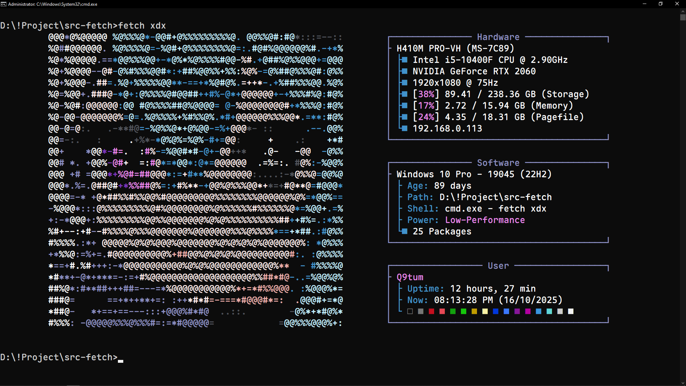

# Fetch-Sama

🔥 Fetch-Sama is a `neofetch`-like tool for Windows.


## Features:
- **Fast** – written in `C` to print system info as fast as possible.
- **ASCII** - includes 11 different ASCII arts.
- **RGB** - prints `RGB` color text in the terminal (cmd, PowerShell, etc.) instead of the default ANSI colors.
- **Custom** - custom console text color using `rgb` CLI.

## Demo:


## Usage:
- Run:
    ```sh
    fetch.exe help
    fetch.exe auto                          # print evil/neuro art based on time
    fetch.exe <file name>                   # print txt file art
    fetch.exe rgb b <r;g;b> <string>        # set background color
    fetch.exe rgb f <r;g;b> <string>        # set foreground color
    fetch.exe rgb rst                       # reset all colors


    # example:
    
    fetch.exe rgb b 255;0;0 "Hello-World!"
    fetch.exe rgb f 0;255;0 "Hello-World!"
    ```

## Special:
  - Four ASCII arts in this project(***Fetch-Sama***) are inspired by the Twitch streamers
      - [Anny](https://www.twitch.tv/anny)
      - [Vedal987](https://www.twitch.tv/vedal987)
      - [Aquwa](https://www.twitch.tv/aquwa)
      - [Camila](https://www.twitch.tv/camila)

## Build:
- **Install Dependencies:**
    - Download and install [MSYS2](https://www.msys2.org/).
    - Open the **mingw64.exe** shell (from the MSYS2 Start Menu).
    - Run the following commands:
        ```sh
        $ pacman -Syu        # Update system packages (MSYS2 may restart)
        $ pacman -Syu        # Run again after restart
        $ pacman -S --needed base-devel mingw-w64-x86_64-toolchain
        ```

- **Set Environment Variables:**
    - Open the **Environment Variables**:
        ```sh
        > rundll32.exe sysdm.cpl,EditEnvironmentVariables   # run in Command Prompt
        ```
    - Add the following paths to your **Path** variable:
        ```
        C:\msys64\mingw64\bin\
        C:\msys64\usr\bin\
        ```

- **Verify Installation:**
    - Run these commands to confirm:
        ```
        > gcc --version
        > g++ --version
        ```
    - If you see version output, your installation was successful 👍

- **Build the Project:**
    - Just run `build.bat`
    - The file `fetch.exe` will appear inside the Source folder.

## Project Structure:
The project has the following structure:

```
.
│
├── build.bat
├── banner.png
├── fetch.c
├── test.c
├── icon.ico
├── icon.rc
├── LICENSE
├── README.md
│
├── configs
│   │
│   ├── anny.txt
│   ├── aquwa.txt
│   ├── camimi.txt
│   ├── cog.txt
│   ├── evil.txt
│   ├── heart.txt
│   ├── imp.txt
│   ├── irl987.txt
│   ├── neuro.txt
│   ├── roshi.txt
│   └── vedal.txt
│   
└── demo
    │
    ├── demo-0.png
    ├── demo-1.png
    ├── demo-2.png
    ├── demo-3.png
    ├── demo-4.png
    ├── demo-5.png
    ├── demo-6.png
    ├── demo-7.png
    ├── demo-8.png
    ├── demo-9.png
    └── demo-10.png
```

## Contributing:
Feel free to contribute to this project by submitting pull requests or reporting issues. Your contributions are greatly appreciated!

## License:
This project is licensed under the [MIT License](LICENSE).

😄 Happy coding!
