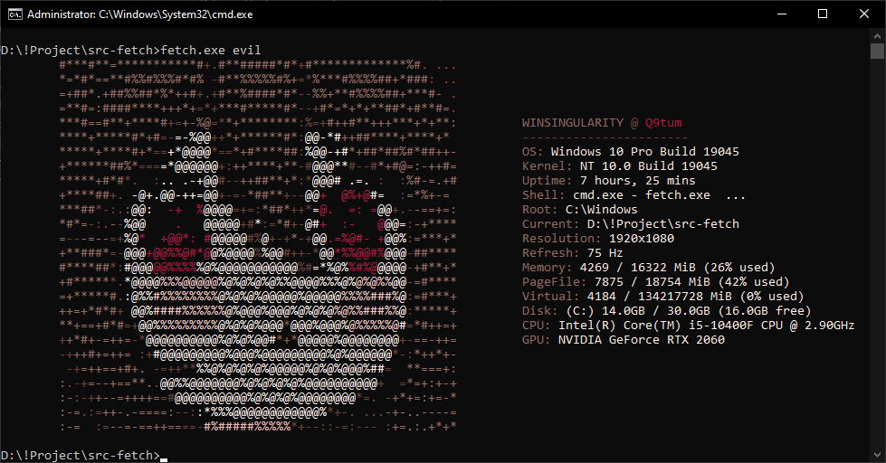

# Fetch-Sama

🔥 Fetch-Sama is a `neofetch`-like tool for Windows.


## Features:
- **Fast** – written in `C` to print system info as fast as possible.
- **ASCII** - includes 3 different ASCII arts (Evil, Neuro & Windows).
- **RGB** - prints `RGB` color text in the terminal (cmd, PowerShell, etc.) instead of the default ANSI colors.

## Demo:


## Usage:
- Run:
    ```sh
    > fetch.exe [name]
    ```
- Example:
    - `evil` ➜ fetch.exe evil
    - `neuro` ➜ fetch.exe neuro
    - `default` ➜ fetch.exe

## Special:
  - Two ASCII arts in this project(***Fetch-Sama***)are inspired by the Twitch streamer [vedal987](https://www.twitch.tv/vedal987) (specifically Evil-Neuro & Neuro-sama).

## Build:
- **Install Dependencies:**
    - Download and install [MSYS2](https://www.msys2.org/).
    - Open the **mingw64.exe** shell (from the MSYS2 Start Menu).
    - Run the following commands:
        ```sh
        $ pacman -Syu        # Update system packages (MSYS2 may restart)
        $ pacman -Syu        # Run again after restart
        $ pacman -S --needed base-devel mingw-w64-x86_64-toolchain
        ```

- **Set Environment Variables:**
    - Open the **Environment Variables**:
        ```sh
        > rundll32.exe sysdm.cpl,EditEnvironmentVariables   # run in Command Prompt
        ```
    - Add the following paths to your **Path** variable:
        ```
        C:\msys64\mingw64\bin\
        C:\msys64\usr\bin\
        ```

- **Verify Installation:**
    - Run these commands to confirm:
        ```
        > gcc --version
        > g++ --version
        ```
    - If you see version output, your installation was successful 👍

- **Build the Project:**
    - Just run `build.bat`
    - The file `fetch.exe` will appear inside the Source folder.

## Project Structure:
The project has the following structure:

```
.
│
├── build.bat
├── banner.png
├── fetch.c
├── icon.ico
├── icon.rc
├── LICENSE
├── README.md
│
└─── demo
      │
      └ pic_1.png
```

## Contributing:
Feel free to contribute to this project by submitting pull requests or reporting issues. Your contributions are greatly appreciated!

## License:
This project is licensed under the [MIT License](LICENSE).

😄 Happy coding!
